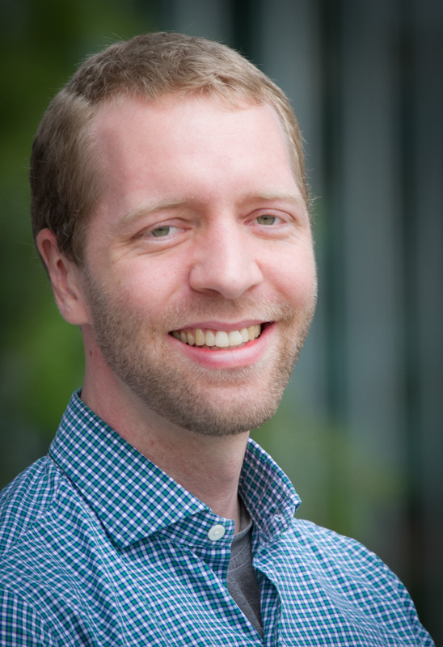

---
---

<link rel="stylesheet" href="styles.css" type="text/css">

### Summary
I am a bioinformatics researcher with expertise analyzing large-scale cancer genomics sequencing data. I am driven by a passion for delivering robust and reproducible research for the benefit of society. My values include: teamwork, inclusion, open science, and leading by example.

### Purpose

I will graduate with my Ph.D. from Washington University in St. Louis in Spring 2020 and then relocate to northern Delaware. For the next stage of my career, I seek to build on my experience with cancer genomics, data analysis, and team leadership gained in [Li Ding's lab at WashU.](https://dinglab.wustl.edu)

### CV
Please find my CV [here](files/most_recent_cv.pdf). I am happy to provide a resume upon request. Thanks!
